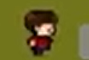
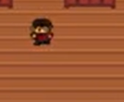
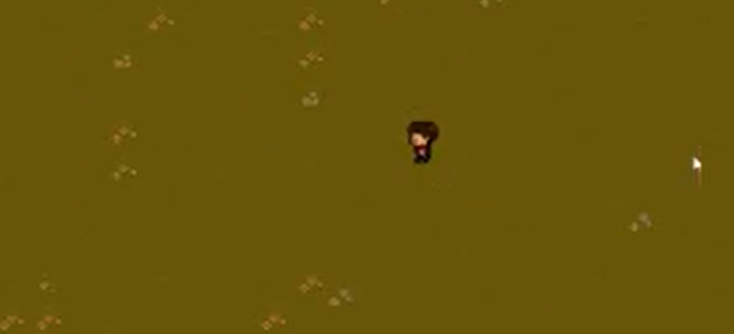
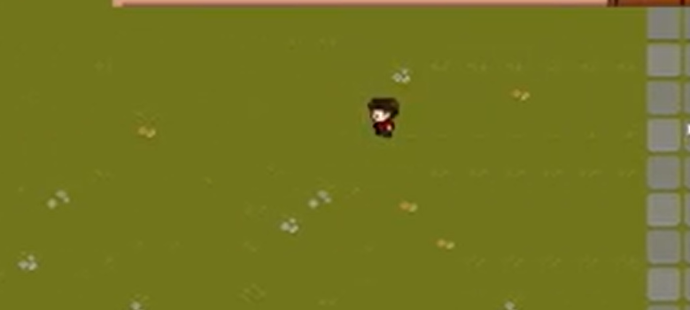
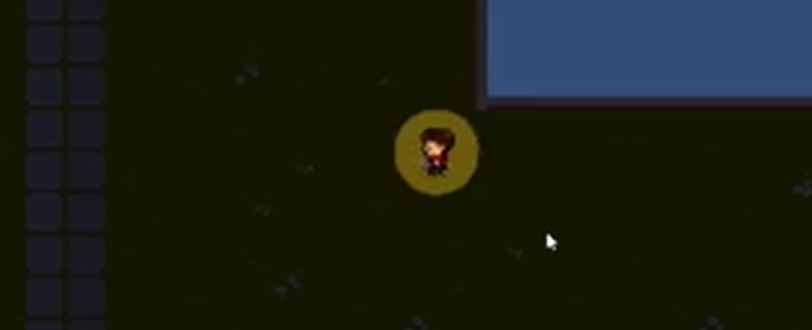
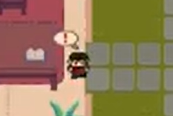
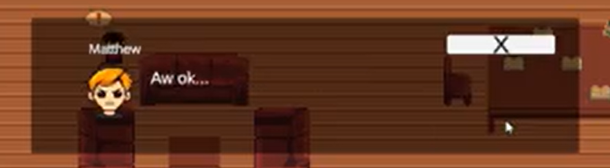
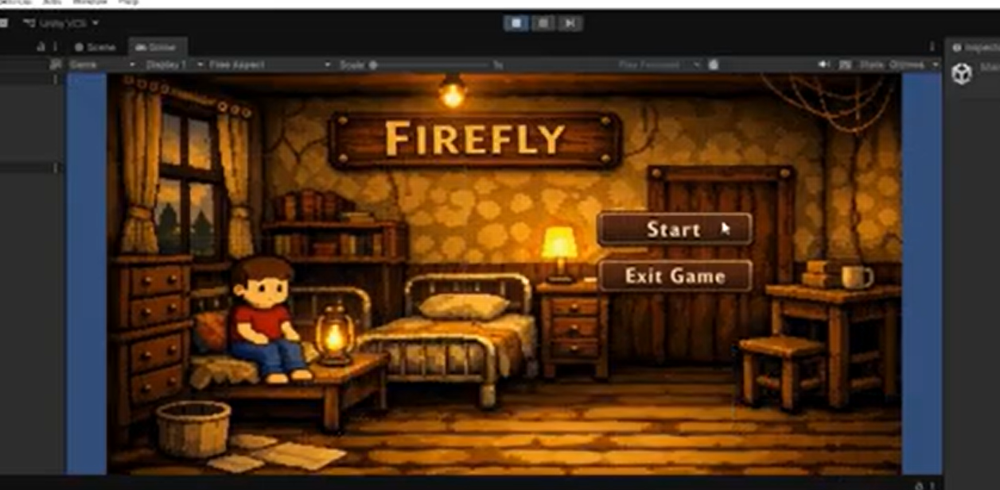
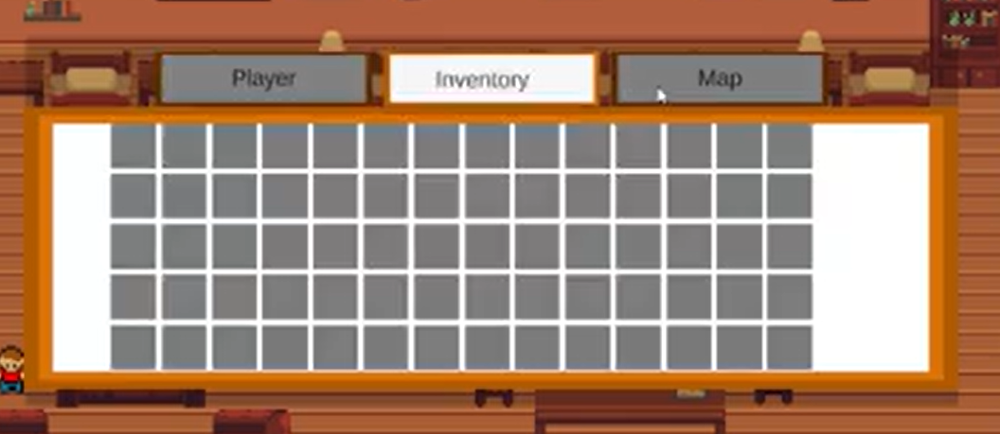

# Unity Game Development Summary

| Field | Detail |
|---|---|
| **Game Title** |Firefly |
| **Student Name(s)** | Jamie L|
| **Class / Course** | 10CT1|
| **Repository** | https://github.com/TempeHS/2026CT_GameDesign_Firefly_Jamie.L|
| **Unity Version** | 6.000.0.58f1|
| **Document Version** | 0.1|
| **Date** |27/08/2026 |

---

## Table of Contents
1. [Game Overview](#1-game-overview)
2. [Video Walkthrough](#2-video-walkthrough)
3. [Game Mechanics](#3-game-mechanics)
4. [Visual Features](#4-visual-features)
5. [Audio Design](#5-audio-design)
6. [User Interface & HUD](#6-user-interface--hud)
7. [Scene & Level Design](#7-scene--level-design)
8. [Scripts & Programming](#8-scripts--programming)
9. [Development Techniques & Tutorials Acknowledged](#9-development-techniques--tutorials-acknowledged)
10. [Third-Party Content Acknowledgements](#10-third-party-content-acknowledgements)
11. [Challenges & Solutions](#11-challenges--solutions)
12. [Branch Development Summary](#12-branch-development-summary)

---

## 1. Game Overview

### 1.1 Genre
Adventure

### 1.2 Target Audience
My target audience is ages 13-20 or anybody interested in adventure games.  

### 1.3 Game Summary
My game is about a child in an orphanage. You have to talk to people, explore, find useful items and discover the secrets of the orphanage. The game is set in a 2D top down perspective. The player can move around the map and interact with objects and NPCs. The player can also open an inventory menu to view their items and map. The player can also transition between rooms. The game is set in a spooky orphanage with a dark atmosphere.

### 1.4 Win / Loss Conditions
The win condition is if you complete the storyline and find out the secrets of the orphanage. There is no loss condition as the player can explore the map and interact with objects and NPCs at their own pace.

### 1.5 Platform & Build Settings
| Setting | Detail |
|---|---|
| WindowsX64 | |
| 1920x1080 | |
| Build Type | |

---

## 2. Video Walkthrough

### 2.1 Full Gameplay Walkthrough

| Field | Detail |
|---|---|
| **My documentation video** | |
| **https://youtu.be/jBVQdJGBPuA** | |
| **4m 50s** | |
| **My documentation video for my computor technology game for 2026.** | |

Apologies for horrible video quality. Idk what went wrong.

### 2.2 Feature Highlight Clips
Inventory feature:https://youtu.be/N3NYn35omfc

---

## 3. Game Mechanics

### 3.1 Core Mechanics
| ID | Mechanic | Description | Implemented In (Script/Object) |
|---|---|---|---|
| M-1 |Interaction |You can interact with NPCs and items |both |
| M-2 |Inventory Menu |An openable inventory with a map and player infomation |both |
| M-3 |Room transitions |you can transition inbetween rooms |both |
| M-4 |Collision |You can bump into objects and walk through some of them|object |
|M-5 |Dialogue |You can talk to NPCs and get information from them |both |
|M-6|Locked doors |some doors will be locked and unable to access |script |

### 3.2 Player Controls
| Action | Input (Keyboard / Controller) | Description |
|---|---|---|
| Walking|WASD |Moving the player around the screen |
|Interaction with objects and NPCS | Hold E| Open Dialouge options

### 3.3 Physics & Collision
| Feature | Description |
|---|---|
| Walk into objects|You stop moving when you crash into something |

### 3.4 Game Loop
| Stage | Description |
|---|---|
| Start / Initialisation |Start Menu |
| Core Loop |Explortaion of map |
| Win / End State |You win when you complete the storyline. |
| Restart | None|

### 3.5 Scoring & Progression
Player progression is based on exploration and discovery of the orphanage's secrets. There is no traditional scoring system.

---

## 4. Visual Features

### 4.1 Particle Effects
None

---

### 4.2 Cut Scenes & Cinematics

There is one final cutscene at the end of the game where the player finds out the secrets of the orphanage. The cutscene is a final talk with the owner. The cutscene is triggered when the player reaches the end of the game and interacts with the diary the second time.

---

### 4.3 Animations

| Animation | Object / Character | Description | Screenshot |
|---|---|---|---|
|Walking |Player |Legs moving forwards and backwards | |
|Idle | Player| Character bouncing up and down whilst not moving| |

---

### 4.4 Lighting & Post-Processing
A warm ambient light is used throughout the game with occassional flickering. The outside is more sunny and bright. After completing NPC quest 3, the lighting turns dark with a spotlight effect on the player. The outside turns to nighttime with a dark, tinted look.

---

### 4.5 Shaders & Materials
none

---

### 4.6 Additional Visual Screenshots

| Description | Screenshot |
|---|---|
|Warm lighting for the regular rooms | |
|Sunny lighting for the outside | |
|Dark lighting for nighttime | |
|Darkness for after the lights go out after interacting with the diary a second time| | 

---

## 5. Audio Design

### 5.1 Music
There is music present throughout my whole game to make the atmosphere and the development of my game clear for the player. Initially, at the start of the game, the music is very warm and peaceful for the player, making them feel relaxed and secure while exploring the orphanage and completing quests.However, once the player has successfully completed NPC Quest 3, the music of the game changes to become more dark and mysterious for the player. It gets slower and mysterious and tells the player that there is a shift taking place somewhere, as things are getting dangerous for the player in the orphanage.
### 5.2 Sound Effects
There are many sound effects in the game to create the feeling of immersion and response from the environment. There is an opening door sound effect that plays whenever the player opens the doors in the environment. There are also footstep sound effects when the player is moving around the orphanage and changing the atmosphere, thus connecting the player to their character.When the player finishes NPC quest 3, a creepy ambience sound effect starts playing. It changes the atmosphere of the environment into a creepier one and creates a connection with the change in background music. With the use of different sounds and music, it shows the player that the orphanage is now a place of danger for the player.
### 5.3 Audio Implementation
I used an audio manager script to manage the background music and sound effects. The audio manager script is attached to a game object in the scene and is responsible for playing the background music and sound effects. The audio manager script has a public method that can be called from other scripts to play sound effects.

---

## 6. User Interface & HUD

### 6.1 HUD Elements
| Element | Purpose | Screenshot |
|---|---|---|
| Interaction Prompt| To tell the player when something then can interact with is nearby| |
|NPC dialogue boxes | To display dialogue from NPCs | |

### 6.2 Menus
| Menu | Purpose | Screenshot |
|---|---|---|
| Main Menu |To display a start and close game button | |
| Inventory |to display a map and item slots | |

---

## 7. Scene & Level Design

### 7.1 Scene List
| Scene Name | Purpose | Description |
|---|---|---|
|Main Menu |To display a start and close game button |A simple main menu screen fit with a title, start button and close button. It has the player on the lefthand side |
| Tutorial|To introduce the players to the mechanics of the game |A small grassy area with a tutorial NPC to let the players figure out how the game works |
| Main Bedroom|Stores the picture frame |A bedroom with tables and the picture frame which is used in the storyline |
|Outside Room | The outside room that connects all the other rooms. Stores NPC1| A large room with lots of doors and grass in the middle|
| Kitchen|No purpose |A kitchen |
| Study|Stores NPC 3 | A small library with a desk|
| Bathroom| Stores NPC2|A bathroom. It has toilets(not working) and sinks |
| Outside| Stores NPC4 and diary|A large outdoors area with a small room to the left |

### 7.2 Level / Environment Screenshots
No levels

### 7.3 Scene Management
| Feature | Description |
|---|---|
| Scene Loading Method |Unity Engine Scene Management |
| Persistent Data Between Scenes |Static Variables |
| Scene Transition Effects |None |

---

## 8. Scripts & Programming

### 8.1 Script Summary
| Script Name | Attached To | Responsibility |
|---|---|---|
| Audio Manager.cs|AudioManager game obejct |Manages Audio |
| Chest.cs|Nothing |Useless dead idea |
|DialogueController.cs |Dialogue Controller game object |Holds dialogue infomation for NPCS in scene |
|FlickeringLight2D.cs |2D Light |Makes the lights flicker occasionally |
|GameState.cs |Gamestate gameobject |Holds the gamestate infomation |
| Global helper.cs|nothing | Helps make the dialogue work|
| IInteractables|nothing |Assists Interaction |
|Interactable.cs |Interaction detector child object around the player |Interaction detector |
|InventoryController.cs |GameController gameobject |Manages the players inventory |
|NPC.cs |All NPCS |NPC code that makes them work |
|OutsideLightingController.cs |Outside lighting manager |Holds the infomation for the outside lighting |
|PlayerController.cs |Player |Controls the player |
|camera.cs |Main Camera |Controls the camera movements |
| menu.cs|UI canvas |holds the infomation for the inventory |
| slot.cs|Slots |holds the infomation for the slots tab in the inventory |
|tabs.cs |Tabs |holds the infomation for the tabs tab in the inventory |
| ConditionalNPCActivator.cs|FinalNPC |Makes the final NPC appear after you reread the diary |
|Diary.cs |Connor's Diary |Holds the info for the diary |
| Door.cs|Every single door |Allows the doors to be interacted with and lets me choose if theyre locked or not |
|ForcedFollowUpDialogue.cs |Cutscene game manager |Holds the info for the cutscene |
| InteractionMessages.cs|Interaction message child object underneath Canvas |gives the baseline for all popups in the game |
| Locked Door.cs|None |Assists the door.cs script |
|MemoryPaper.cs |None |Nothing. Dead idea |
| PapaerUI.cs| None| Nothing. Dead idea|
|RoomLightingController.cs |Roomlighting game controller | Lets me change the lighting in all the rooms|
| SecondQuestItem.cs|Photograph |Hold the photograph infomation |
### 8.2 Key Algorithms / Logic
| Feature | Script | Description |
|---|---|---|
| Tag based scene routing | Door.cs | Uses `CompareTag()` to determine which scene to load and which spawn point to use, avoiding a separate script per door |
| Spawn point persistence | PlayerController.cs | Uses a static string `targetSpawn` to pass data between scenes so the player appears at the correct location after a scene load |

### 8.3 Design Patterns Used
| Pattern | Where Applied | Justification |
|---|---|---|
| Singleton | AudioManager.Instance | Ensures only one AudioManager exists so music/SFX don't overlap or duplicate across scenes |
| Static/Global State | PlayerController.targetSpawn | Simple way to pass spawn location data between scenes without needing a persistent manager object |
| Interface | IInteractable (implemented by Door) | Allows different objects (doors, NPCs, items) to share a common `Interact()`/`CanInteract()` contract, so interaction code can treat them polymorphically |

---

## 9. Development Techniques & Tutorials Acknowledged

> List every tutorial, course, video, or article that informed or guided your implementation. Include what you used it for and what you changed or adapted.

| # | Title | Author / Creator | URL / Source | What You Used It For | What You Changed / Adapted |
|---|---|---|---|---|---|
| 1 |
Start Menu - 2D Platformer Unity #28 |Game Code Library |https://www.youtube.com/watch?v=paaBTt5GcMU |Base of my start menu |Changed the artwork and titling of my game |
| 2 |Drag and Drop Inventory UI - Top Down Unity 2D #8
 |Game Code Library |https://www.youtube.com/watch?v=wlBJ0yZOYfM |My inventory slots |Changed the formatting, amount of slots and parts of the code |
| 3 |Menu UI with Tab Switching - Top Down Unity 2D #6
 | Game Code Library|https://www.youtube.com/watch?v=liba3xGI4gM&t=762s |Baseline for my menu |Assisted me in making my menu but did change most of the code |
| 4 | Create a Dialogue System with Branching Choices - Top Down Unity 2D #22
|Game Code Library |https://www.youtube.com/watch?v=zbYuLu_8spI&t=1027s |Baseline for dialogue system |Added the feature that makes dialogue change based on how far into the game you are |
| 5 |Add an Interaction System to your Game - Top Down Unity 2D #16
 | Game Code Library| https://www.youtube.com/watch?v=MPP9GLp44Pc&t=812s|Making my interaction system |None |
| 6 |Idle and Walking Player Animations - Top Down Unity 2D #2
 |Game Code Library |https://www.youtube.com/watch?v=82U4ToJU-28&t=632s |Animating my player character |None |
| 7 | PERFECT Tilemap Sorting Layers - Top Down Unity 2D #3
|Game Code Library |https://www.youtube.com/watch?v=UId0mwanBZg&t=138s |I used it as a starting guide  |Amount of tilemap sorting layers |
| 8 |Enter and Exit Buildings in ONE Scene! - Top Down Unity 2D #30
 | Game Code Library|https://www.youtube.com/watch?v=4D9utRDwH90 | None|Nothing. Dead idea |
 |Player Tracking and Camera Bounds - Top Down Unity 2D #4
 | Game Code Library|https://www.youtube.com/watch?v=kV9rVinFyAk |Camera tracking |I added camera locks to the sides of the game so the camera wouldn't fly off |
 |Player Movement with Unity Input System - Top Down Unity 2D #1
|Game Code Library https://www.youtube.com/watch?v=DQY62meLVCk&t=323s| Player movement|None |

---

## 10. Third-Party Content Acknowledgements

> All third-party assets (art, audio, fonts, scripts, packages) must be listed here with their licence. Using an asset without acknowledgement may constitute academic misconduct.

### 10.1 Visual Assets
| Asset Name | Type | Creator / Source | Licence | URL | Used For |
|---|---|---|---|---|---|
|Fancy Mansion Furniture Set free | Tilemap|0_mem0ry | Commercial and non-commercial use permitted. Assets may be modified, but may not be resold or redistributed. Not permitted for AI/NFT use or AI training.| https://0-mem0ry.itch.io/fancy-mansion-furniture-set-free|Tilemaping |
| Pixel Art Top Down - Basic v1.2.3|Tilemap |Cainos |Commercial and non-commercial use permitted. Assets may be modified. Credit is not required but appreciated. Assets may not be redistributed or resold. | https://cainos.itch.io/pixel-art-top-down-basic?download|Tilemaping |
| Ninja Adventure Asset Pack|Sprites |pixel-boy |Creative Common Zero(CCO) |https://pixel-boy.itch.io/ninja-adventure-asset-pack | Sprites|

### 10.2 Audio Assets
| Asset Name | Type | Creator / Source | Licence | URL | Used For |
|---|---|---|---|---|---|
| Text/Dialogue Bleeps Pack|.ogg | dmochas|Creative Commons Attribution 4.0 International License | https://dmochas-assets.itch.io/dmochas-bleeps-pack|Dialogue |
|Quiet Interior Room Tone 03 |.mp3 |SFX Mint |CC0 |https://sfxmint.com/sounds/ambience-room-tone-03 |Background Music |
|Light Interior Door Opening 01| .mp3 | SFX Mint|CC0| https://sfxmint.com/sounds/door-open-01|Door Opening |
|Slow Walking Footsteps On Wooden Floor 25 |.mp3 |SFX Mint |CC0 | https://sfxmint.com/sounds/footsteps-wood-25|Footsteps |
| Horror Atmosphere|.ogg |SubspaceAudio |CC0 |https://opengameart.org/content/horror-atmosphere|Horror Atmosphere |

### 10.3 Scripts & Code Snippets
None

### 10.4 Unity Packages & Plugins
None

### 10.5 Fonts
None

---

## 11. Challenges & Solutions

| # | Challenge Encountered | How It Was Solved |
|---|---|---|
| 1 | | |
| 2 | | |
| 3 | | |
| 4 | | |
| 5 | | |

---

## 12. Branch Development Summary

> One section per feature branch. Add or remove sections to match your repository. Branches should be named for the feature they implement e.g. `feature/player-movement`. Link each branch name directly to the branch in your GitHub repository.

---

### Branch 1 — `main`

| Field | Detail |
|---|---|
| **Branch Name** | `main` |
| **Purpose** | Stable, releasable version of the game |
| **Merged From** | |
| **Final Commit** | |

---

### Branch 2 — `feature/`

| Field | Detail |
|---|---|
| **Branch Name** | |
| **Feature Developed** | |
| **Merged Into** | |
| **Date Started** | |
| **Date Merged** | |

#### What Was Built
<!-- Describe what this branch added or changed -->

#### Key Commits
| Commit Message | What Changed |
|---|---|
| | |
| | |
| | |

#### Problems Encountered & Resolved
| Problem | Resolution |
|---|---|
| | |
| | |

#### Screenshot / Evidence
> ``

---

### Branch 3 — `feature/`

| Field | Detail |
|---|---|
| **Branch Name** | |
| **Feature Developed** | |
| **Merged Into** | |
| **Date Started** | |
| **Date Merged** | |

#### What Was Built

#### Key Commits
| Commit Message | What Changed |
|---|---|
| | |
| | |
| | |

#### Problems Encountered & Resolved
| Problem | Resolution |
|---|---|
| | |
| | |

#### Screenshot / Evidence
> ``

---

### Branch 4 — `feature/`

| Field | Detail |
|---|---|
| **Branch Name** | |
| **Feature Developed** | |
| **Merged Into** | |
| **Date Started** | |
| **Date Merged** | |

#### What Was Built

#### Key Commits
| Commit Message | What Changed |
|---|---|
| | |
| | |
| | |

#### Problems Encountered & Resolved
| Problem | Resolution |
|---|---|
| | |
| | |

#### Screenshot / Evidence
> ``

---

### Branch 5 — `feature/`

| Field | Detail |
|---|---|
| **Branch Name** | |
| **Feature Developed** | |
| **Merged Into** | |
| **Date Started** | |
| **Date Merged** | |

#### What Was Built

#### Key Commits
| Commit Message | What Changed |
|---|---|
| | |
| | |
| | |

#### Problems Encountered & Resolved
| Problem | Resolution |
|---|---|
| | |
| | |

#### Screenshot / Evidence
> ``

---

### Branch 6 — `feature/`

| Field | Detail |
|---|---|
| **Branch Name** | |
| **Feature Developed** | |
| **Merged Into** | |
| **Date Started** | |
| **Date Merged** | |

#### What Was Built

#### Key Commits
| Commit Message | What Changed |
|---|---|
| | |
| | |
| | |

#### Problems Encountered & Resolved
| Problem | Resolution |
|---|---|
| | |
| | |

#### Screenshot / Evidence
> ``

---

### Branch Development Overview

> Complete this summary table once all branches are finished.

| Branch Name | Feature | Date Started | Date Merged | Status |
|---|---|---|---|---|
| `main` | Stable release | | | |
| `feature/` | | | | |
| `feature/` | | | | |
| `feature/` | | | | |
| `feature/` | | | | |
| `feature/` | | | | |

---

> **Student Declaration:** All work submitted is my own except where explicitly acknowledged above.